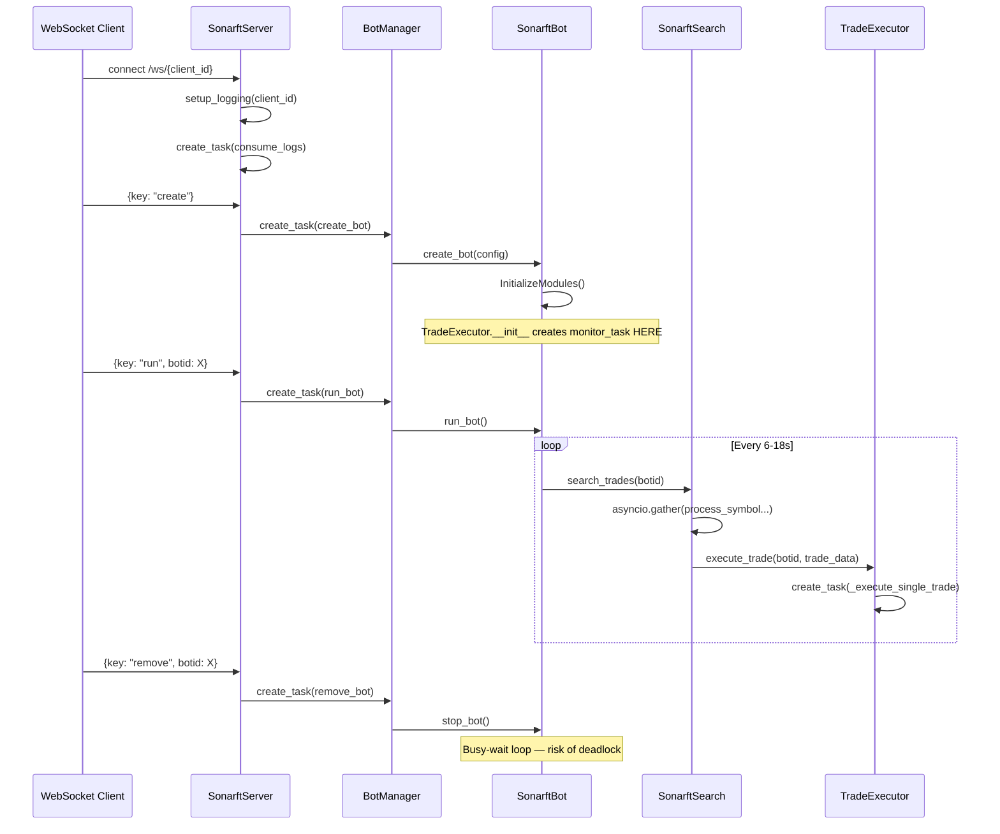

# SonarFT — Async Design & Concurrency Review

## 1. Concurrency Risk Table

| # | File | Function | Issue | Severity |
|---|---|---|---|---|
| 1 | `sonarft_search.py` | `TradeExecutor.__init__` | `asyncio.create_task` called in `__init__` — no running event loop guaranteed | **Critical** |
| 2 | `sonarft_execution.py` | `monitor_price` | Infinite `while True` with no timeout or cancellation path | **High** |
| 3 | `sonarft_execution.py` | `monitor_order` | Infinite `while True` with no timeout or cancellation path | **High** |
| 4 | `sonarft_bot.py` | `stop_bot` | Busy-wait `while self.stop_bot_flag` with `asyncio.sleep(1)` — flag is set by `run_bot` only after loop exits, creating a deadlock | **High** |
| 5 | `sonarft_api_manager.py` | `sync_wait_for_rate_limit` | `exchange.sleep(rate_limit)` is a **blocking** call inside an async context | **High** |
| 6 | `sonarft_server.py` | `process_websocket_tasks` | New `receive_task` and `send_task` created on every loop iteration — unbounded task creation if messages arrive faster than they are processed | **Medium** |
| 7 | `sonarft_server.py` | `send_logs` | Inner `while True` with `asyncio.sleep(1)` — never cancelled on disconnect | **Medium** |
| 8 | `sonarft_manager.py` | `set_update` / `get_update` | Acquires `_lock` then calls `get_bot_instance` which also acquires `_lock` — **deadlock** | **High** |
| 9 | `sonarft_server.py` | `cleanup_done_tasks` | Iterates `self.tasks` while potentially mutating it; uses `list(self.tasks)` copy — safe, but exception from `task.exception()` is only printed, not handled | **Low** |
| 10 | `sonarft_search.py` | `monitor_trade_tasks` | Filters `trade_tasks` to non-done tasks, then immediately iterates the same list checking `task.done()` — the second loop body is unreachable | **Medium** |
| 11 | `sonarft_bot.py` | `run_bot` | `asyncio.sleep(random.randint(6,18))` — randomised sleep is not cancellation-aware | **Low** |
| 12 | `sonarft_api_manager.py` | `call_api_method` (ccxt branch) | `result = method_call(*args, **kwargs)` — synchronous ccxt call blocks the event loop | **High** |

---

## 2. Issue Details

### Issue 1 — `asyncio.create_task` in `__init__` (Critical)

**File:** `sonarft_search.py`, `TradeExecutor.__init__`

```python
self.monitor_task = asyncio.create_task(self.monitor_trade_tasks())
```

`TradeExecutor` is instantiated inside `TradeProcessor.__init__`, which is called from `SonarftSearch.__init__`, which is called from `SonarftBot.InitializeModules` (an `async` method). At that point the event loop is running, so this does not crash — but it is fragile: any refactor that moves instantiation outside an async context will raise `RuntimeError: no running event loop`.

**Fix:** Move task creation to an explicit `async def start()` method called after construction, or use `asyncio.ensure_future` with a guard.

---

### Issue 2 & 3 — Infinite loops without timeout (`monitor_price`, `monitor_order`)

**File:** `sonarft_execution.py`

```python
async def monitor_price(self, ...):
    while True:
        await asyncio.sleep(3)
        price = await self.api_manager.get_last_price(...)
        if side == 'buy' and price_to_check >= price:
            return price
        if side == 'sell' and price_to_check <= price:
            return price
```

If the price never reaches the target (e.g. during a strong trend), this loop runs forever, blocking the trade task indefinitely. The same applies to `monitor_order`.

**Fix:** Add a configurable `max_wait_seconds` parameter and raise `TimeoutError` or return `None` after expiry.

```python
deadline = asyncio.get_event_loop().time() + max_wait_seconds
while asyncio.get_event_loop().time() < deadline:
    ...
raise TimeoutError(f"Price monitoring timed out for {exchange_id}")
```

---

### Issue 4 — `stop_bot` deadlock

**File:** `sonarft_bot.py`

```python
async def stop_bot(self):
    self.stop_bot_flag = True
    while self.stop_bot_flag:
        await asyncio.sleep(1)
```

`run_bot` sets `stop_bot_flag = False` only after `return` — but `stop_bot` is waiting for the flag to become `False`. The flag is never cleared inside `run_bot`; it is reset to `False` by `BotManager.run_bot` **after** `run_bot` returns. This means `stop_bot` will wait indefinitely if `run_bot` is blocked inside `monitor_price` or `monitor_order`.

**Fix:** Use `asyncio.Event` for clean signalling:

```python
self._stop_event = asyncio.Event()

async def stop_bot(self):
    self._stop_event.set()
    # run_bot checks: if self._stop_event.is_set(): return
```

---

### Issue 5 & 12 — Blocking calls in async context

**File:** `sonarft_api_manager.py`, `sync_wait_for_rate_limit` and the ccxt branch of `call_api_method`

```python
def sync_wait_for_rate_limit(self, exchange):
    rate_limit = exchange.rateLimit / 1000
    exchange.sleep(rate_limit)   # blocks the event loop thread
```

```python
if self.__ccxt__:
    self.sync_wait_for_rate_limit(exchange)
    result = method_call(*args, **kwargs)  # synchronous ccxt call
```

Both `exchange.sleep` and synchronous ccxt REST calls block the entire asyncio event loop, stalling all other coroutines (including WebSocket heartbeats and other bot cycles).

**Fix:** Wrap synchronous calls with `asyncio.get_event_loop().run_in_executor(None, ...)`:

```python
import asyncio
result = await asyncio.get_event_loop().run_in_executor(
    None, method_call, *args
)
```

---

### Issue 8 — Re-entrant lock deadlock

**File:** `sonarft_manager.py`, `set_update` and `get_update`

```python
async def set_update(self, botid, update_data) -> bool:
    async with self._lock:                        # acquires lock
        sonarftbot = await self.get_bot_instance(botid)  # also acquires lock → deadlock
```

`asyncio.Lock` is **not** re-entrant. The second `async with self._lock` inside `get_bot_instance` will block forever.

**Fix:** Extract the dict lookup into a private non-locking helper:

```python
def _get_bot_unsafe(self, botid):
    return self._bots.get(botid)

async def set_update(self, botid, update_data) -> bool:
    async with self._lock:
        bot = self._get_bot_unsafe(botid)
        ...
```

---

### Issue 10 — Unreachable loop body in `monitor_trade_tasks`

**File:** `sonarft_search.py`, `TradeExecutor.monitor_trade_tasks`

```python
self.trade_tasks = [task for task in self.trade_tasks if not task.done()]
for task in self.trade_tasks:
    if task.done():   # always False — just filtered out done tasks above
        ...
```

The inner `if task.done()` block is dead code.

**Fix:**

```python
done_tasks = [t for t in self.trade_tasks if t.done()]
self.trade_tasks = [t for t in self.trade_tasks if not t.done()]
for task in done_tasks:
    try:
        self.logger.info(f"Result {task.result()}")
    except Exception as e:
        self.logger.error(f"Trade task raised an exception: {e}")
```

---

## 3. Task Lifecycle Summary



---

## 4. Async Pattern Assessment

| Pattern | Used Correctly | Notes |
|---|---|---|
| `async/await` on all I/O | Mostly yes | ccxt REST branch is blocking |
| `asyncio.gather` for parallel work | Yes | Used in `search_trades`, `TradeValidator`, `SonarftValidators` |
| `asyncio.Lock` for shared state | Partially | Re-entrant deadlock in `set_update`/`get_update` |
| Task cleanup | Partially | `cleanup_done_tasks` works; `monitor_trade_tasks` has dead code |
| Cancellation support | No | No `asyncio.CancelledError` handling anywhere |
| Timeout on blocking loops | No | `monitor_price` and `monitor_order` have no timeout |
| Blocking calls in async | Violated | ccxt REST path and `exchange.sleep` block the loop |
