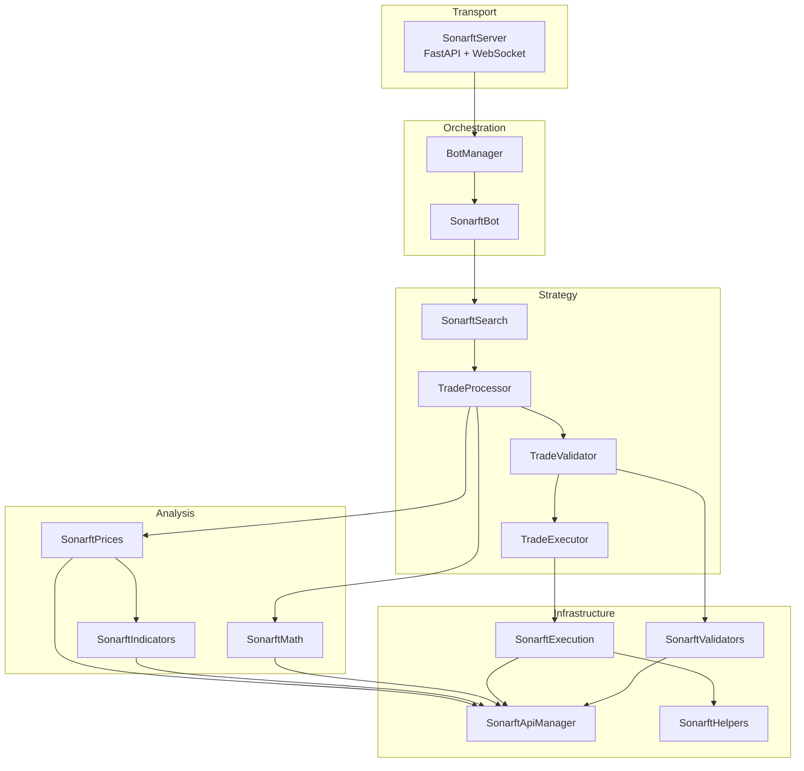

# SonarFT — Architecture & Project Structure

## 1. Technology Stack Inventory

| Category | Technology | Version | Notes |
|---|---|---|---|
| Language | Python | 3.10.6 | Pinned in Dockerfile |
| HTTP/WS Server | FastAPI + Uvicorn | 0.100.0 / 0.22.0 | ASGI, async-native |
| Async Runtime | asyncio (stdlib) | — | All I/O is async |
| Exchange API | ccxt | 3.0.24 | REST fallback |
| Exchange API | ccxt.pro | bundled with ccxt | WebSocket default |
| Technical Analysis | pandas-ta | 0.3.14b0 | RSI, MACD, StochRSI, SMA |
| Data Manipulation | pandas | 1.5.3 | Series for indicator input |
| Numerical | numpy | transitive | std, percentile, median |
| Config | JSON files | — | No schema validation |
| Env vars | python-dotenv / python-decouple | 1.0.0 / 3.8 | `.env` loading |
| Container | Docker + Docker Compose | python:3.10.6 base | Traefik v2.5 reverse proxy |
| Logging | stdlib `logging` + custom `AsyncHandler` | — | Per-client WebSocket streaming |
| Decimal precision | `decimal.getcontext().prec = 8` | — | Set per-file, not globally |

**Missing from requirements.txt:** `ccxt.pro` is not listed as a separate dependency — it ships inside `ccxt >= 2.x` as `ccxt.pro`, so this is acceptable but undocumented.

---

## 2. Project Structure

```
sonarft/
├── sonarft.py                  # Entry point — uvicorn startup
├── sonarft_server.py           # Transport layer: FastAPI, WebSocket, per-client logging
├── sonarft_manager.py          # Orchestration: BotManager lifecycle
├── sonarft_bot.py              # Bot init, config loading, module wiring
├── sonarft_search.py           # Strategy: SonarftSearch, TradeProcessor, TradeValidator, TradeExecutor
├── sonarft_prices.py           # Analysis: VWAP, weighted price adjustment
├── sonarft_indicators.py       # Analysis: RSI, MACD, StochRSI, SMA, volatility
├── sonarft_math.py             # Analysis: fee/profit calculation
├── sonarft_execution.py        # Infrastructure: order placement, balance check
├── sonarft_validators.py       # Infrastructure: liquidity, spread, slippage
├── sonarft_api_manager.py      # Infrastructure: ccxt/ccxtpro abstraction
├── sonarft_helpers.py          # Infrastructure: file I/O, Trade dataclass
└── sonarftdata/                # JSON config and runtime data
```

### Module Responsibility Map

| Module | Layer | Primary Responsibility | Lines (approx.) |
|---|---|---|---|
| `sonarft.py` | Entry | uvicorn startup | 18 |
| `sonarft_server.py` | Transport | FastAPI endpoints, WebSocket, log streaming | ~310 |
| `sonarft_manager.py` | Orchestration | Bot lifecycle, client-to-bot registry | ~200 |
| `sonarft_bot.py` | Orchestration | Config loading, module wiring, run loop | ~280 |
| `sonarft_search.py` | Strategy | Trade search, validation gate, execution dispatch | ~220 |
| `sonarft_prices.py` | Analysis | Price adjustment, VWAP blend, spread factors | ~230 |
| `sonarft_indicators.py` | Analysis | All technical indicators, order book helpers | ~340 |
| `sonarft_math.py` | Analysis | Fee/profit math, exchange precision rules | ~90 |
| `sonarft_execution.py` | Infrastructure | Order creation, monitoring, balance check | ~230 |
| `sonarft_validators.py` | Infrastructure | Liquidity depth, spread threshold, slippage | ~200 |
| `sonarft_api_manager.py` | Infrastructure | ccxt/ccxtpro dispatch, VWAP, price fetch | ~260 |
| `sonarft_helpers.py` | Infrastructure | Trade dataclass, JSON file I/O | ~180 |

---

## 3. Layered Architecture



---

## 4. Dependency Design

### Dependency Injection — Confirmed

All modules receive their dependencies via constructor. `SonarftBot.InitializeModules` is the single wiring point:

```
SonarftBot
  └─ SonarftApiManager (library, exchanges, fees, logger)
  └─ SonarftHelpers (is_simulating_trade, logger)
  └─ SonarftValidators (api_manager, logger)
  └─ SonarftIndicators (api_manager, logger)
  └─ SonarftMath (api_manager)
  └─ SonarftPrices (api_manager, sonarft_indicators, logger)
  └─ SonarftExecution (api_manager, sonarft_helpers, sonarft_indicators, is_simulating_trade, logger)
  └─ SonarftSearch (sonarft_math, sonarft_prices, sonarft_validators, sonarft_execution, ...)
       └─ TradeProcessor (sonarft_validators, sonarft_execution, sonarft_math, sonarft_prices, logger)
            └─ TradeValidator (sonarft_validators, logger)
            └─ TradeExecutor (sonarft_execution, logger)
```

### Tight Coupling Issues

| Issue | Location | Severity |
|---|---|---|
| `SonarftMath` has no logger injected | `sonarft_math.py` | Low |
| `SonarftIndicators` duplicates order book / history wrappers also present in `SonarftPrices` | Both files | Medium |
| `SonarftExecution` re-fetches all indicators already computed in `SonarftPrices.weighted_adjust_prices` | `sonarft_execution.py:_execute_single_trade` | Medium |
| `TradeExecutor.monitor_task` is created in `__init__` before the event loop is guaranteed to be running | `sonarft_search.py:TradeExecutor.__init__` | High |
| `SonarftServer` directly mutates `self.botmanager.logger` on every WebSocket connection | `sonarft_server.py:websocket_endpoint` | Medium |

### Responsibility Leaks

- `SonarftIndicators` contains `get_order_book`, `get_history`, `get_trading_volume`, `get_trade_history` — these are thin wrappers that duplicate the same wrappers in `SonarftPrices` and `SonarftValidators`. All three modules call `api_manager` directly for the same data.
- `SonarftBot.save_botid` and `SonarftHelpers.save_botid` both exist and do the same thing (`sonarft_bot.py:save_botid`, `sonarft_helpers.py:save_botid`).

---

## 5. Architecture Summary

SonarFT is a well-layered, dependency-injected, async-first trading system. The separation of concerns across Transport → Orchestration → Strategy → Analysis → Infrastructure is clear and largely respected. The main structural weaknesses are:

1. Indicator data is fetched redundantly across multiple modules per trade cycle — no shared cache layer exists.
2. `TradeExecutor` creates an `asyncio.create_task` in `__init__`, which is unsafe outside a running event loop.
3. The `SonarftServer` CORS policy is fully open (`allow_origins=["*"]`), which is a security concern for a financial application.
4. No schema validation exists for any JSON configuration file.
5. `config_1` and `config_2` in `config.json` are identical — the multi-config system is not exercised.
