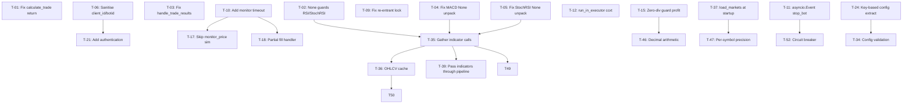

# Implementation Roadmap — SonarFT

---

## Executive Summary

### System Readiness Status

SonarFT is **not production-ready**. The system contains multiple confirmed crash paths in the core trade pipeline, two re-entrant deadlocks, three critical security vulnerabilities, and zero test coverage. It is suitable for **simulation-only use** after Phase 0 fixes are applied.

### Overall Assessment

| Dimension | Status |
|---|---|
| Trading correctness | ❌ Multiple crash paths in live trade execution |
| Financial math safety | ❌ Float arithmetic, zero-division risks, wrong divisors |
| Async safety | ❌ Deadlocks, blocking calls, infinite loops |
| Security | ❌ Path traversal, open CORS, unauthenticated endpoints |
| Performance | ⚠️ 20 sequential API calls per symbol per cycle |
| Test coverage | ❌ Zero test files |
| Simulation mode | ⚠️ Functional but still calls live APIs unnecessarily |

### Effort & Scope

| Field | Value |
|---|---|
| Total effort level | **Large** |
| Implementation phases | **6 (Phase 0 through Phase 5)** |
| Estimated total effort | 55–90 developer-days |
| Recommended team size | 2–3 engineers |

### Primary Risk Domains

1. **Trading Safety** — crash paths in `calculate_trade`, `handle_trade_results`, `weighted_adjust_prices`
2. **Async Correctness** — deadlocks in `BotManager`, blocking ccxt calls, infinite monitor loops
3. **Security** — path traversal via `client_id`/`botid`, open CORS, unauthenticated API
4. **Financial Precision** — float arithmetic throughout, hardcoded exchange precision rules
5. **Performance** — 20 sequential API calls per symbol, no OHLCV caching

### Top Architectural Priorities

1. Fix all crash paths before any live trading is attempted
2. Resolve async deadlocks and blocking calls
3. Harden security layer (path validation, CORS, auth)
4. Introduce OHLCV caching and parallel indicator fetching
5. Establish a test suite before any production deployment

---

## Issue-to-Task Conversion Matrix

| ID | Source Document | Affected Files | Severity | Task Description | Risk Category | Complexity | Effort | Dependencies | Validation Method |
|---|---|---|---|---|---|---|---|---|---|
| T-01 | trading-engine-analysis.md | `sonarft_math.py`, `sonarft_search.py` | Critical | Fix `calculate_trade` returning 4 values while caller unpacks 3 — align return signature | Trading | Low | 1h | — | Unit test: call with missing fee entry, assert no `ValueError` |
| T-02 | trading-engine-analysis.md | `sonarft_prices.py` | Critical | Add `None` guards for RSI and StochRSI before arithmetic in `weighted_adjust_prices` | Trading | Low | 2h | — | Unit test: mock `get_rsi` returning `None`, assert no `TypeError` |
| T-03 | trading-engine-analysis.md | `sonarft_execution.py` | Critical | Fix `handle_trade_results` unpacking `None` order result — add `None` check before unpack | Trading | Low | 1h | — | Unit test: pass `None` as `result_buy_order`, assert graceful return |
| T-04 | indicator-analysis.md | `sonarft_prices.py`, `sonarft_indicators.py` | Critical | Fix `dynamic_volatility_adjustment` unpacking `None` from `get_macd` — add `None` guard before tuple unpack | Trading | Low | 1h | — | Unit test: mock `get_macd` returning `None`, assert no `TypeError` |
| T-05 | indicator-analysis.md | `sonarft_indicators.py` | Critical | Fix `get_stoch_rsi` returning `None` while callers unpack as `k, d = await get_stoch_rsi(...)` | Trading | Low | 1h | — | Unit test: mock failure path, assert caller handles `None` |
| T-06 | security-audit.md | `sonarft_server.py` | Critical | Add `client_id` and `botid` input sanitisation on all HTTP and WebSocket endpoints to prevent path traversal | Security | Low | 2h | — | Security test: supply `../../etc/passwd` as `client_id`, assert 400 response |
| T-07 | security-audit.md | `sonarft_server.py` | Critical | Restrict CORS `allow_origins` from `["*"]` to known frontend origins; remove `allow_credentials=True` with wildcard | Security | Low | 1h | — | Manual test: verify browser rejects cross-origin credentialed request |
| T-08 | security-audit.md | `docker-compose.yml` | Critical | Remove `--api.insecure=true` from Traefik; add BasicAuth or restrict dashboard to internal network | Security | Low | 2h | — | Verify dashboard is inaccessible without credentials |
| T-09 | async-concurrency.md | `sonarft_manager.py` | High | Fix re-entrant `asyncio.Lock` deadlock in `set_update`/`get_update` — extract private non-locking `_get_bot_unsafe` helper | Async | Low | 1h | — | Integration test: call `set_update` concurrently, assert no deadlock |
| T-10 | async-concurrency.md | `sonarft_execution.py` | High | Add configurable `max_wait_seconds` timeout to `monitor_price` and `monitor_order` infinite loops | Async | Low | 2h | — | Unit test: mock price never reaching target, assert `TimeoutError` raised within deadline |
| T-11 | async-concurrency.md | `sonarft_bot.py` | High | Replace busy-wait `stop_bot` flag with `asyncio.Event` to eliminate deadlock when `run_bot` is blocked | Async | Low | 2h | — | Integration test: call `stop_bot` while `monitor_price` is running, assert clean exit |
| T-12 | async-concurrency.md | `sonarft_api_manager.py` | High | Wrap synchronous ccxt REST calls and `exchange.sleep` in `asyncio.get_event_loop().run_in_executor` | Async | Medium | 3h | — | Load test: run ccxt mode with 3 bots, verify event loop is not blocked |
| T-13 | trading-engine-analysis.md | `sonarft_math.py` | High | Add `KeyError` guard for exchanges not in `EXCHANGE_RULES` — return error tuple or raise descriptive exception | Trading | Low | 1h | — | Unit test: call `calculate_trade` with `exchange='kraken'`, assert no `KeyError` |
| T-14 | financial-math-review.md | `sonarft_api_manager.py` | High | Add zero-division guard in `get_weighted_prices` when `total_bid_volume` or `total_ask_volume` is zero | Trading | Low | 30m | — | Unit test: pass empty order book, assert returns `(0.0, 0.0)` |
| T-15 | financial-math-review.md | `sonarft_math.py` | High | Add zero-division guard in `calculate_trade` when `value_buying_with_fee` is zero | Trading | Low | 30m | — | Unit test: pass `buy_price=0`, assert no `ZeroDivisionError` |
| T-16 | trading-engine-analysis.md | `sonarft_prices.py` | High | Clamp `weight` to `[0.0, 1.0]` in `weighted_adjust_prices` to prevent negative price blend | Trading | Low | 15m | — | Unit test: simulate high volatility, assert `weight >= 0` |
| T-17 | execution-analysis.md | `sonarft_execution.py` | High | Skip `monitor_price` in simulation mode — use target price directly to prevent live API blocking | Trading | Low | 30m | T-10 | Simulation test: run full cycle in sim mode, assert no `monitor_price` call |
| T-18 | execution-analysis.md | `sonarft_execution.py` | High | Add partial fill handler — if buy is partially filled, cancel or complete before placing sell leg | Trading | High | 2d | T-10 | Integration test: simulate partial fill, assert sell leg is not placed prematurely |
| T-19 | security-audit.md | `Dockerfile` | High | Run container as non-root user — uncomment non-root user lines in Dockerfile | Security | Low | 30m | — | Verify `whoami` inside container returns non-root |
| T-20 | security-audit.md | `Dockerfile` | High | Remove `.env` file from Docker image — inject secrets at runtime via Docker secrets or environment variables | Security | Low | 1h | — | Inspect image layers, confirm no `.env` present |
| T-21 | security-audit.md | `sonarft_server.py` | High | Add authentication (API key or JWT) to all HTTP endpoints and WebSocket connections | Security | High | 3d | T-06 | Security test: call endpoint without token, assert 401 |
| T-22 | security-audit.md | `sonarft_server.py` | High | Add per-client bot creation limit to prevent memory exhaustion | Security | Low | 1h | T-06 | Load test: create 100 bots from one client, assert limit enforced |
| T-23 | async-concurrency.md | `sonarft_search.py` | High | Move `asyncio.create_task` out of `TradeExecutor.__init__` into an explicit `async def start()` method | Async | Low | 1h | — | Code review: verify no task creation in constructors |
| T-24 | config-review.md | `sonarft_bot.py` | High | Replace `tuple(parameters.values())` with explicit key-based extraction to prevent wrong-variable assignment | Trading | Low | 30m | — | Unit test: reorder JSON keys, assert correct variable assignment |
| T-25 | indicator-analysis.md | `sonarft_indicators.py` | Medium | Fix `market_movement` direction bug — `else: "bear"` is a no-op string expression, not an assignment | Trading | Low | 15m | — | Unit test: assert `market_movement` returns `'bear'` for bear conditions |
| T-26 | indicator-analysis.md | `sonarft_indicators.py` | Medium | Fix `get_short_term_market_trend` threshold unit mismatch — `price_change` is in percent but threshold is `0.001` | Trading | Low | 15m | — | Unit test: assert trend returns `'bull'` only for meaningful price moves |
| T-27 | financial-math-review.md | `sonarft_validators.py` | Medium | Fix hardcoded `/100` divisor in `get_trade_dynamic_spread_threshold_avg` — use actual entry count | Trading | Low | 30m | — | Unit test: pass order book with 5 entries, assert correct average |
| T-28 | indicator-analysis.md | `sonarft_indicators.py` | Medium | Fix MACD column name hardcoded as `'MACD_12_26_9'` — derive column name from actual parameters | Trading | Low | 30m | — | Unit test: call `get_macd` with non-default periods, assert no `KeyError` |
| T-29 | financial-math-review.md | `sonarft_indicators.py` | Medium | Add zero-division guard in `get_short_term_market_trend` when `previous_avg_price == 0` | Trading | Low | 15m | — | Unit test: pass zero previous price, assert returns `'neutral'` |
| T-30 | financial-math-review.md | `sonarft_indicators.py` | Medium | Add zero-division guard in `get_liquidity` when `bids[0][0] + asks[0][0] == 0` | Trading | Low | 15m | — | Unit test: pass zero-price order book, assert no `ZeroDivisionError` |
| T-31 | async-concurrency.md | `sonarft_server.py` | Medium | Fix `send_logs` inner `while True` — cancel task on WebSocket disconnect | Async | Low | 1h | — | Integration test: disconnect client, assert log task is cancelled |
| T-32 | async-concurrency.md | `sonarft_search.py` | Medium | Fix unreachable loop body in `monitor_trade_tasks` — separate done/active task lists correctly | Async | Low | 30m | — | Code review + unit test: assert done task exceptions are logged |
| T-33 | security-audit.md | `sonarft_server.py` | Medium | Replace all `print()` calls with `self.logger` — 8 confirmed instances across server and manager | Security | Low | 1h | — | Code review: grep for `print(` in production files |
| T-34 | config-review.md | `sonarft_bot.py` | Medium | Add startup validation for all config fields (`profit_percentage_threshold > 0`, `trade_amount > 0`, etc.) | Architecture | Low | 2h | T-24 | Unit test: pass invalid config, assert `ValueError` before bot starts |
| T-35 | performance-analysis.md | `sonarft_prices.py` | High | Parallelise all indicator calls in `weighted_adjust_prices` using `asyncio.gather` | Performance | Medium | 1d | T-02, T-04, T-05 | Benchmark: measure cycle time before/after, assert ≥50% reduction |
| T-36 | performance-analysis.md | `sonarft_api_manager.py` | High | Add OHLCV cache with TTL equal to candle duration — eliminate redundant fetches across indicators | Performance | Medium | 2d | T-35 | Benchmark: count API calls per cycle, assert reduction |
| T-37 | performance-analysis.md | `sonarft_api_manager.py` | Medium | Move `load_markets` call to startup — remove from per-symbol price fetch loop | Performance | Low | 1h | — | Integration test: verify markets loaded once at init |
| T-38 | performance-analysis.md | `sonarft_validators.py` | High | Add explicit `limit` parameter to `get_trade_spread_threshold` history fetch — replace `limit=None` | Performance | Low | 30m | — | Integration test: verify bounded history fetch |
| T-39 | performance-analysis.md | `sonarft_execution.py`, `sonarft_search.py` | High | Pass computed indicator values through `trade_data` to `_execute_single_trade` — eliminate re-fetch | Performance | Medium | 1d | T-35 | Benchmark: count API calls during execution, assert 6 fewer calls per trade |
| T-40 | performance-analysis.md | `sonarft_api_manager.py` | Medium | Parallelise order book + ticker fetches per exchange in `get_latest_prices` using `asyncio.gather` | Performance | Low | 2h | — | Benchmark: measure `get_latest_prices` latency before/after |
| T-41 | performance-analysis.md | `sonarft_server.py` | Low | Replace `list.pop(0)` with `collections.deque.popleft()` in `send_logs` log handler | Performance | Low | 30m | — | Load test: high-frequency logging, assert no degradation |
| T-42 | code-quality-review.md | `sonarft_execution.py` | Medium | Fix typos `trade_sucess`, `buy_order_sucess`, `sell_order_sucess` throughout execution module | Architecture | Low | 15m | — | Code review: grep for `sucess` |
| T-43 | code-quality-review.md | `sonarft_bot.py`, `sonarft_helpers.py` | Low | Remove duplicate `save_botid` method — keep only in `SonarftHelpers` | Architecture | Low | 30m | — | Code review: verify single implementation |
| T-44 | code-quality-review.md | Multiple | Low | Remove dead code: unused `t = round(time.time())`, unreachable loop body, commented-out price blocks | Architecture | Low | 1h | T-32 | Code review: no dead code remains |
| T-45 | code-quality-review.md | Multiple | Low | Remove or replace all `getcontext().prec = 8` imports — either use `Decimal` or remove the dead import | Architecture | Low | 30m | — | Code review: no unused `getcontext` imports |
| T-46 | financial-math-review.md | `sonarft_math.py` | Medium | Replace float arithmetic with `decimal.Decimal` in `calculate_trade` for fee and profit calculations | Trading | Medium | 1d | T-15 | Unit test: compare `Decimal` vs `float` results for known inputs |
| T-47 | financial-math-review.md | `sonarft_math.py` | Medium | Load per-symbol precision from exchange API (`exchange.markets[symbol]['precision']`) instead of hardcoded `EXCHANGE_RULES` | Trading | High | 3d | T-37 | Integration test: verify precision matches exchange-reported values |
| T-48 | code-quality-review.md | `sonarft_prices.py`, `sonarft_search.py` | Low | Add module-level docstrings to `sonarft_search.py` and `sonarft_prices.py` | Architecture | Low | 30m | — | Code review |
| T-49 | code-quality-review.md | `sonarft_prices.py` | Low | Decompose `weighted_adjust_prices` (~130 lines) into focused sub-methods | Architecture | Medium | 3h | T-35 | Code review: no method exceeds 50 lines |
| T-50 | code-quality-review.md | Multiple | Low | Consolidate duplicate OHLCV/order book wrapper methods — single source in `SonarftApiManager` | Architecture | Medium | 2h | T-36 | Code review: no duplicate wrappers |
| T-51 | security-audit.md | `sonarft_bot.py` | Low | Replace `random.randint` botid generation with `uuid4()` to eliminate collision risk | Security | Low | 15m | — | Unit test: generate 10,000 IDs, assert no collisions |
| T-52 | security-audit.md | `sonarft_server.py` | High | Add circuit breaker / failure counter in `run_bot` — backoff on repeated exchange errors | Trading | Medium | 1d | T-11 | Integration test: simulate exchange outage, assert backoff activates |
| T-53 | security-audit.md | Entire execution path | Critical | Add `max_daily_loss` parameter — halt bot when cumulative loss exceeds threshold | Trading | High | 3d | T-34 | Simulation test: trigger loss threshold, assert bot halts |
| T-54 | execution-analysis.md | `sonarft_execution.py` | Medium | Move `save_order_history` call to after order placement result is known | Trading | Low | 30m | — | Unit test: simulate failed order, assert not recorded as attempted |

---

## Phase-Based Implementation Plan

---

### Phase 0 — Critical Safety Fixes

**Objective:** Eliminate all confirmed crash paths in the trade pipeline and resolve the most dangerous async deadlocks. After this phase, the bot must be able to complete a full simulation cycle without crashing.

**Tasks Included:**

| Task | Description | Effort |
|---|---|---|
| T-01 | Fix `calculate_trade` 4-value return / 3-value unpack | 1h |
| T-02 | Add `None` guards for RSI/StochRSI in `weighted_adjust_prices` | 2h |
| T-03 | Fix `handle_trade_results` `None` unpack crash | 1h |
| T-04 | Fix `dynamic_volatility_adjustment` `None` MACD unpack | 1h |
| T-05 | Fix `get_stoch_rsi` `None` return unpack in callers | 1h |
| T-09 | Fix re-entrant lock deadlock in `set_update`/`get_update` | 1h |
| T-11 | Replace `stop_bot` busy-wait with `asyncio.Event` | 2h |
| T-13 | Add `KeyError` guard for unknown exchanges in `EXCHANGE_RULES` | 1h |
| T-14 | Add zero-division guard in `get_weighted_prices` | 30m |
| T-15 | Add zero-division guard in `calculate_trade` profit percentage | 30m |
| T-16 | Clamp `weight` to `[0.0, 1.0]` in `weighted_adjust_prices` | 15m |
| T-25 | Fix `market_movement` direction no-op bug | 15m |
| T-53 | Add `max_daily_loss` halt parameter | 3d |

**Total Phase 0 Effort:** ~4–5 days

**Risk Reduction Impact:** Eliminates all confirmed `ValueError`, `TypeError`, `KeyError`, and `ZeroDivisionError` crash paths. Resolves the `BotManager` deadlock. Adds minimum financial safety guard.

**Expected Stability Gains:** Bot completes full simulation cycles without crashing. `stop_bot` works reliably.

**Exit Criteria:**
- Full simulation cycle completes without exception for all configured symbols
- `calculate_trade` handles all error paths without crashing callers
- `stop_bot` terminates cleanly while `monitor_price` is running
- `set_update` and `get_update` execute concurrently without deadlock
- `max_daily_loss` halts the bot when threshold is exceeded in simulation

---

### Phase 1 — Stability & Reliability

**Objective:** Resolve remaining async hazards, fix data validation gaps, and harden the execution path against partial fills and infinite loops.

**Tasks Included:**

| Task | Description | Effort |
|---|---|---|
| T-10 | Add timeout to `monitor_price` and `monitor_order` | 2h |
| T-12 | Wrap blocking ccxt REST calls in `run_in_executor` | 3h |
| T-17 | Skip `monitor_price` in simulation mode | 30m |
| T-18 | Add partial fill handler in `execute_long_trade` / `execute_short_trade` | 2d |
| T-23 | Move `asyncio.create_task` out of `TradeExecutor.__init__` | 1h |
| T-24 | Replace `tuple(parameters.values())` with key-based config extraction | 30m |
| T-26 | Fix `get_short_term_market_trend` threshold unit mismatch | 15m |
| T-27 | Fix hardcoded `/100` divisor in spread threshold average | 30m |
| T-28 | Fix MACD column name hardcoding | 30m |
| T-29 | Add zero-division guard in `get_short_term_market_trend` | 15m |
| T-30 | Add zero-division guard in `get_liquidity` | 15m |
| T-31 | Cancel `send_logs` task on WebSocket disconnect | 1h |
| T-32 | Fix unreachable loop body in `monitor_trade_tasks` | 30m |
| T-34 | Add startup config field validation | 2h |
| T-52 | Add circuit breaker / failure backoff in `run_bot` | 1d |
| T-54 | Move `save_order_history` to after order placement | 30m |

**Total Phase 1 Effort:** ~5–6 days

**Risk Reduction Impact:** Eliminates infinite loop risks in trade monitoring. Prevents wrong config variable assignment. Fixes simulation mode live API blocking. Adds circuit breaker against exchange outages.

**Expected Stability Gains:** Bot recovers gracefully from exchange errors. Simulation mode runs fully offline. Config loading is deterministic regardless of JSON key order.

**Exit Criteria:**
- `monitor_price` and `monitor_order` respect timeout and return cleanly
- ccxt REST mode does not block the event loop (verified with concurrent bots)
- Simulation mode completes a full cycle with zero live API calls to `monitor_price`
- Config loaded with reordered JSON keys assigns correct variables
- Circuit breaker activates after configurable failure count

---

### Phase 2 — Security Hardening

**Objective:** Close all confirmed security vulnerabilities before any network-exposed deployment.

**Tasks Included:**

| Task | Description | Effort |
|---|---|---|
| T-06 | Sanitise `client_id` and `botid` on all endpoints | 2h |
| T-07 | Restrict CORS to known origins | 1h |
| T-08 | Secure Traefik dashboard — remove `--api.insecure=true` | 2h |
| T-19 | Run Docker container as non-root user | 30m |
| T-20 | Remove `.env` from Docker image — inject secrets at runtime | 1h |
| T-21 | Add API key or JWT authentication to HTTP and WebSocket endpoints | 3d |
| T-22 | Add per-client bot creation limit | 1h |
| T-33 | Replace all `print()` with `self.logger` | 1h |
| T-51 | Replace `random.randint` botid with `uuid4()` | 15m |

**Total Phase 2 Effort:** ~5–6 days

**Risk Reduction Impact:** Eliminates path traversal attack surface. Prevents CSRF via CORS. Closes unauthenticated admin access. Removes secrets from image layers.

**Expected Stability Gains:** Server is safe to expose on a public network. No arbitrary file read/write via URL parameters.

**Exit Criteria:**
- Path traversal test with `../../etc/passwd` returns HTTP 400
- CORS rejects credentialed requests from unlisted origins
- Traefik dashboard requires authentication
- Docker container runs as non-root
- All HTTP and WebSocket endpoints require a valid token
- No `print()` calls remain in production code

---

### Phase 3 — Performance Optimization

**Objective:** Reduce per-cycle API call count and latency to enable practical multi-symbol, multi-exchange operation.

**Tasks Included:**

| Task | Description | Effort |
|---|---|---|
| T-35 | Parallelise all indicator calls in `weighted_adjust_prices` with `asyncio.gather` | 1d |
| T-36 | Add OHLCV cache with TTL equal to candle duration | 2d |
| T-37 | Move `load_markets` to startup — remove from price fetch loop | 1h |
| T-38 | Add explicit `limit` to `get_trade_spread_threshold` history fetch | 30m |
| T-39 | Pass indicator values through `trade_data` to eliminate re-fetch at execution | 1d |
| T-40 | Parallelise order book + ticker fetches per exchange in `get_latest_prices` | 2h |
| T-41 | Replace `list.pop(0)` with `deque.popleft()` in `send_logs` | 30m |

**Total Phase 3 Effort:** ~5–6 days

**Risk Reduction Impact:** Reduces cycle time from ~5s to ~0.5s for 5 symbols. Eliminates unbounded history fetches. Reduces exchange API rate limit pressure.

**Expected Stability Gains:** Bot sustains higher symbol counts without hitting rate limits. Execution decisions use fresher data (indicators computed once, not twice).

**Exit Criteria:**
- Benchmark shows ≥50% reduction in per-cycle API call count
- `weighted_adjust_prices` completes in under 200ms for 2 exchanges
- `load_markets` called exactly once per bot lifecycle
- `get_trade_spread_threshold` fetches bounded history (≤100 candles)

---

### Phase 4 — Architecture Improvements

**Objective:** Reduce duplication, improve maintainability, and align the codebase with its own stated design principles.

**Tasks Included:**

| Task | Description | Effort |
|---|---|---|
| T-42 | Fix typos `sucess` → `success` throughout execution module | 15m |
| T-43 | Remove duplicate `save_botid` — keep only in `SonarftHelpers` | 30m |
| T-44 | Remove all confirmed dead code | 1h |
| T-45 | Remove unused `getcontext().prec = 8` imports or replace with `Decimal` | 30m |
| T-46 | Replace float arithmetic with `decimal.Decimal` in `calculate_trade` | 1d |
| T-47 | Load per-symbol precision from exchange API instead of hardcoded `EXCHANGE_RULES` | 3d |
| T-48 | Add module docstrings to `sonarft_search.py` and `sonarft_prices.py` | 30m |
| T-49 | Decompose `weighted_adjust_prices` into focused sub-methods | 3h |
| T-50 | Consolidate duplicate OHLCV/order book wrappers into `SonarftApiManager` | 2h |

**Total Phase 4 Effort:** ~6–8 days

**Risk Reduction Impact:** Eliminates float precision errors in fee/profit calculations. Removes hardcoded exchange precision that causes invalid orders on Binance and other exchanges.

**Expected Stability Gains:** Codebase is easier to extend. Exchange precision is correct per-symbol. No duplicate logic to maintain.

**Exit Criteria:**
- `calculate_trade` uses `Decimal` for all fee and profit arithmetic
- Exchange precision loaded from live market data, not hardcoded constants
- No duplicate wrapper methods across modules
- `weighted_adjust_prices` decomposed into ≤3 sub-methods each under 50 lines
- No dead code or unused imports remain

---

### Phase 5 — Feature & Strategy Enhancements

**Objective:** Improve indicator quality and extend trading strategy capabilities based on identified weaknesses.

**Tasks Included:**

| Task | Description | Effort |
|---|---|---|
| — | Replace naive min/max support/resistance with pivot-point or clustering approach | 3d |
| — | Make spread factors (`spread_increase_factor`, `spread_decrease_factor`) configurable via `config_indicators.json` | 1d |
| — | Implement `bull+bear` and `bear+bull` mixed-signal spread logic (currently commented out) | 2d |
| — | Add NaN handling for all pandas-ta indicator outputs before returning values | 1d |
| — | Load `config_indicators.json` at bot startup and wire indicator parameters from config | 2d |
| — | Add position size validation against available balance before trade search begins | 1d |

**Total Phase 5 Effort:** ~10–12 days

**Risk Reduction Impact:** Improves signal quality. Eliminates silent NaN failures in indicator pipeline. Makes indicator parameters configurable without code changes.

**Expected Stability Gains:** Indicator pipeline is robust to data gaps. Strategy behaviour is fully config-driven.

**Exit Criteria:**
- All indicator functions return a typed result or a documented sentinel value — never silent `NaN`
- Spread factors are loaded from config, not hardcoded
- Mixed bull/bear signal branches produce defined behaviour
- Position size is validated against balance before any trade search

---

## Dependency Graph

### Task Prerequisites

| Task | Depends On | Reason |
|---|---|---|
| T-17 | T-10 | Simulation skip only meaningful after timeout is added |
| T-35 | T-02, T-04, T-05 | Parallelising calls is safe only after `None` guards are in place |
| T-39 | T-35 | Indicator values can only be passed through pipeline after gather is implemented |
| T-36 | T-35 | Cache is most effective after gather reduces redundant calls |
| T-46 | T-15 | Zero-division guard must exist before switching to `Decimal` arithmetic |
| T-47 | T-37 | Per-symbol precision requires markets to be loaded at startup |
| T-34 | T-24 | Config validation depends on key-based extraction being in place |
| T-21 | T-06 | Auth layer depends on sanitised identifiers |
| T-52 | T-11 | Circuit breaker depends on clean stop signalling |
| T-49 | T-35 | Decomposition is cleaner after gather refactor is done |
| T-50 | T-36 | Consolidation is cleaner after cache layer is introduced |

### Blocking Relationships

- **T-01, T-02, T-03, T-04, T-05** block all live trading — must be resolved before any real order is placed
- **T-09** blocks concurrent bot operations — `set_update`/`get_update` deadlock affects multi-bot setups
- **T-06** blocks **T-21** — authentication is ineffective without sanitised identifiers
- **T-10** blocks **T-18** — partial fill handling requires a timeout-aware monitor loop

### Parallelisable Tasks (no inter-dependencies)

The following tasks can be worked on simultaneously by different engineers:

- **Track A (Trading Safety):** T-01, T-02, T-03, T-04, T-05, T-13, T-14, T-15, T-16
- **Track B (Async Safety):** T-09, T-10, T-11, T-12, T-23
- **Track C (Security):** T-06, T-07, T-08, T-19, T-20
- **Track D (Config):** T-24, T-25, T-26, T-34

---

## Risk Reduction Mapping

| Phase | Risk Before | Risk After | Impact Level |
|---|---|---|---|
| Phase 0 | `calculate_trade` crashes on every unknown exchange or zero price; `weighted_adjust_prices` crashes on any indicator failure; `BotManager` deadlocks under concurrent bot operations; no financial loss limit | All confirmed crash paths eliminated; deadlock resolved; `max_daily_loss` guard active | **Critical → Low** |
| Phase 1 | `monitor_price`/`monitor_order` run forever locking capital; ccxt REST blocks entire event loop; simulation mode makes live API calls; config variables assigned to wrong fields on JSON key reorder | Infinite loops bounded by timeout; event loop unblocked; simulation fully offline; config loading deterministic | **High → Low** |
| Phase 2 | Path traversal allows arbitrary file read/write; any origin can make credentialed API requests; Traefik dashboard fully open; container runs as root; secrets baked into image | All attack surfaces closed; endpoints authenticated; container hardened | **Critical → Low** |
| Phase 3 | 20 sequential API calls per symbol per cycle (~5s for 5 symbols); unbounded history fetches; duplicate indicator computation at execution time | ~2 parallel API calls per symbol per cycle (~0.2s); bounded fetches; indicators computed once | **High → Low** |
| Phase 4 | Float arithmetic in fee/profit calculations introduces rounding errors; hardcoded exchange precision causes invalid orders on non-listed exchanges; duplicate code creates maintenance risk | `Decimal` precision in financial calculations; per-symbol precision from exchange API; no duplicate logic | **Medium → Low** |
| Phase 5 | Naive support/resistance; silent NaN indicator failures; spread factors not configurable; mixed signal branches undefined | Robust indicator pipeline; configurable strategy parameters; defined mixed-signal behaviour | **Medium → Low** |

### Financial Loss Risk Focus

| Risk | Phase Addressed | Severity Before | Severity After |
|---|---|---|---|
| Bot crashes mid-trade leaving open position | Phase 0 (T-03, T-04) | Critical | Low |
| Partial fill leaves unhedged buy position | Phase 1 (T-18) | High | Low |
| `monitor_price` infinite loop locks capital indefinitely | Phase 1 (T-10) | High | Low |
| No maximum daily loss limit | Phase 0 (T-53) | Critical | Low |
| Wrong trade amount from config key reorder | Phase 1 (T-24) | High | Low |
| Float rounding error in fee calculation | Phase 4 (T-46) | Medium | Low |
| Invalid order size from hardcoded precision | Phase 4 (T-47) | Medium | Low |

---

## Effort & Timeline Estimation

### Per-Phase Breakdown

| Phase | Tasks | Effort (Days) | Team Size | Duration Estimate |
|---|---|---|---|---|
| Phase 0 — Critical Safety | T-01 to T-16, T-25, T-53 | 4–5 | 1–2 engineers | 3–5 days |
| Phase 1 — Stability | T-10, T-12, T-17, T-18, T-23, T-24, T-26–T-32, T-34, T-52, T-54 | 5–6 | 1–2 engineers | 4–6 days |
| Phase 2 — Security | T-06, T-07, T-08, T-19–T-22, T-33, T-51 | 5–6 | 1 engineer | 5–6 days |
| Phase 3 — Performance | T-35–T-41 | 5–6 | 1–2 engineers | 4–5 days |
| Phase 4 — Architecture | T-42–T-50 | 6–8 | 1–2 engineers | 5–7 days |
| Phase 5 — Enhancements | Strategy improvements | 10–12 | 2 engineers | 8–10 days |
| **Total** | | **35–43 days** | **2–3 engineers** | **6–9 weeks** |

### Conservative vs Aggressive Estimates

| Scenario | Total Duration | Assumptions |
|---|---|---|
| Conservative | 9–11 weeks | 1 engineer, part-time, includes review cycles |
| Aggressive | 5–6 weeks | 2 engineers full-time, parallel tracks, no blockers |
| Recommended | 7–8 weeks | 2 engineers, sequential phases 0–2, parallel phases 3–4 |

### Recommended Team Composition

| Role | Phases | Responsibilities |
|---|---|---|
| Senior Python / Async Engineer | 0, 1, 3 | Crash fixes, async refactoring, performance optimisation |
| Security Engineer | 2 | Path traversal, CORS, auth, Docker hardening |
| Quant / Trading Engineer | 0, 4, 5 | Financial math, indicator correctness, strategy logic |

---

## Technical Debt Backlog

Items below are lower-priority improvements that do not block trading safety but should be addressed to maintain long-term code health.

| # | Category | Item | Priority (1–5) | Benefit | Recommended Window |
|---|---|---|---|---|---|
| D-01 | Refactoring | Decompose `weighted_adjust_prices` into sub-methods (gather fetch, compute signals, apply spread) | 4 | Reduces cognitive complexity; easier to unit test each stage | Phase 4 |
| D-02 | Refactoring | Consolidate OHLCV/order book wrapper methods — single source in `SonarftApiManager` | 4 | Eliminates 3-way duplication across `SonarftIndicators`, `SonarftPrices`, `SonarftValidators` | Phase 4 |
| D-03 | Refactoring | Remove duplicate `save_botid` from `SonarftBot` — delegate entirely to `SonarftHelpers` | 3 | Single responsibility; avoids divergence | Phase 4 |
| D-04 | Refactoring | Replace hardcoded `EXCHANGE_RULES` with dynamic per-symbol precision from exchange API | 5 | Prevents invalid orders on any exchange not in the hardcoded list | Phase 4 |
| D-05 | Refactoring | Make `spread_increase_factor` and `spread_decrease_factor` configurable via `config_indicators.json` | 3 | Strategy tuning without code changes | Phase 5 |
| D-06 | Documentation | Add module-level docstrings to `sonarft_search.py` and `sonarft_prices.py` | 2 | Consistency with project convention | Phase 4 |
| D-07 | Documentation | Document `profit_percentage` field as a ratio (not a percentage) in `SonarftMath` | 2 | Prevents future misinterpretation by developers | Phase 4 |
| D-08 | Documentation | Document `config_indicators.json` loading gap — currently referenced in config but never loaded at startup | 3 | Prevents confusion about which indicator parameters are actually active | Phase 1 |
| D-09 | Documentation | Add type annotations to `SonarftBot.__init__` and all internal helper methods missing return types | 2 | Improves IDE support and static analysis | Phase 4 |
| D-10 | Testing | Unit tests for `SonarftMath.calculate_trade` — zero price, unknown exchange, fee rate `None` | 5 | Highest-value test: directly covers confirmed crash paths | Phase 0 exit |
| D-11 | Testing | Unit tests for all indicator functions with mock OHLCV data — NaN returns, empty data, zero prices | 5 | Covers the entire indicator pipeline crash surface | Phase 1 exit |
| D-12 | Testing | Integration tests for `TradeProcessor.process_trade_combination` with mocked API | 4 | Validates full trade decision pipeline end-to-end | Phase 1 exit |
| D-13 | Testing | Security tests for path traversal via `client_id` and `botid` | 5 | Directly validates T-06 fix | Phase 2 exit |
| D-14 | Testing | Load tests for multi-bot concurrency — verify no event loop blocking under ccxt REST mode | 4 | Validates T-12 fix | Phase 1 exit |
| D-15 | Logging | Replace all 8 confirmed `print()` calls with `self.logger` | 4 | Consistent log routing; prevents PII leakage to stdout | Phase 2 |
| D-16 | Logging | Add structured log fields for trade events (botid, symbol, exchange, profit) | 3 | Enables log-based monitoring and alerting | Phase 3 |
| D-17 | Logging | Add `maxsize` to `asyncio.Queue` in `AsyncHandler` to prevent unbounded memory growth | 3 | Prevents memory exhaustion under high log volume | Phase 1 |
| D-18 | Config | Differentiate `config_1` and `config_2` in `config.json` — currently identical | 2 | Exercises the multi-config system | Phase 1 |
| D-19 | Config | Add JSON schema validation for all config files at startup | 3 | Catches misconfiguration before bot starts | Phase 1 |
| D-20 | Infrastructure | Add trade history rotation or database backend — current append-only JSON grows unbounded | 3 | Prevents disk exhaustion in long-running deployments | Phase 3 |
| D-21 | Infrastructure | Mount `sonarftdata/history/` and `sonarftdata/bots/` as Docker volumes | 4 | Prevents trade history loss on container restart | Phase 2 |

---

## Testing & Validation Strategy

### Test Coverage Targets by Phase

#### Phase 0 Exit — Minimum Safety Tests

| Target | Type | Description |
|---|---|---|
| `SonarftMath.calculate_trade` | Unit | Zero buy price, unknown exchange key, `None` fee rate, correct profit ratio |
| `weighted_adjust_prices` | Unit | Mock `get_rsi` returning `None` — assert no `TypeError`; mock high volatility — assert `weight >= 0` |
| `handle_trade_results` | Unit | Pass `None` as `result_buy_order` — assert graceful return, no unpack crash |
| `dynamic_volatility_adjustment` | Unit | Mock `get_macd` returning `None` — assert no `TypeError` |
| `BotManager.set_update` | Integration | Call `set_update` and `get_update` concurrently — assert no deadlock |
| `stop_bot` | Integration | Call `stop_bot` while `monitor_price` is running — assert clean exit within 5s |

#### Phase 1 Exit — Stability Tests

| Target | Type | Description |
|---|---|---|
| `monitor_price` | Unit | Mock price never reaching target — assert `TimeoutError` raised within `max_wait_seconds` |
| `monitor_order` | Unit | Mock order never filling — assert timeout and clean return |
| `call_api_method` (ccxt) | Load | Run 3 bots in ccxt mode concurrently — assert event loop latency < 100ms |
| `execute_long_trade` | Integration | Simulate partial fill on buy — assert sell leg is not placed |
| `load_parameters` | Unit | Reorder JSON keys — assert correct variable assignment |
| `get_short_term_market_trend` | Unit | Pass zero previous price — assert returns `'neutral'` |
| `get_trade_dynamic_spread_threshold_avg` | Unit | Pass order book with 5 entries — assert divisor is 5, not 100 |
| `run_bot` circuit breaker | Integration | Simulate 5 consecutive exchange errors — assert backoff activates |

#### Phase 2 Exit — Security Tests

| Target | Type | Description |
|---|---|---|
| `GET /bot/get_parameters/{client_id}` | Security | Supply `../../etc/passwd` as `client_id` — assert HTTP 400 |
| `POST /bot/set_parameters/{client_id}` | Security | Supply path traversal string — assert HTTP 400, no file written |
| CORS headers | Manual | Send credentialed request from unlisted origin — assert browser rejection |
| WebSocket `/ws/{client_id}` | Security | Connect without valid token — assert connection refused |
| Docker image | Inspection | Run `docker inspect` — assert no `.env` layer, non-root user |

#### Phase 3 Exit — Performance Tests

| Target | Type | Description |
|---|---|---|
| `weighted_adjust_prices` | Benchmark | Measure wall time for 2 exchanges — assert < 200ms after gather |
| API call count per cycle | Benchmark | Count calls for 5 symbols — assert ≤ 10 (down from ~100) |
| `get_trade_spread_threshold` | Integration | Verify history fetch uses bounded `limit` — assert ≤ 100 candles |
| `load_markets` | Integration | Verify called exactly once per bot lifecycle |

#### Phase 4 Exit — Correctness Tests

| Target | Type | Description |
|---|---|---|
| `calculate_trade` with `Decimal` | Unit | Compare `Decimal` vs `float` results for known BTC/USDT inputs — assert difference < 1e-8 |
| Per-symbol precision | Integration | Verify `prices_precision` matches `exchange.markets[symbol]['precision']['price']` |
| `market_movement` | Unit | Assert returns `'bear'` for bear conditions (regression for T-25 fix) |
| `get_macd` column name | Unit | Call with non-default periods — assert no `KeyError` |

### Simulation Test Strategy

All trading logic tests must be runnable in simulation mode (`is_simulating_trade=1`) with mocked exchange API responses. The test harness should:

1. Mock `SonarftApiManager` to return deterministic order book and OHLCV data
2. Run a full `search_trades` → `process_symbol` → `execute_trade` cycle
3. Assert trade history is written correctly
4. Assert no real orders are placed (verify `create_order` is never called on the real API)

### Regression Test Strategy

After each phase, run the full simulation cycle against all configured symbols and assert:
- No unhandled exceptions
- Trade history files are written
- Bot stops cleanly on `stop_bot` signal
- Log output contains expected lifecycle events

### Load Test Strategy

For Phase 3 validation, run 5 bots simultaneously with 3 exchanges and 5 symbols each:
- Measure event loop lag using `asyncio` debug mode
- Assert no task takes longer than 2× its expected duration
- Assert memory growth is bounded (< 50MB per bot per hour)

---

## Release Strategy

---

### Milestone A — Safe Simulation Mode

**Objective:** Bot runs complete trade cycles in simulation without crashing, blocking, or leaking data.

**Readiness Requirements:**
- All Phase 0 tasks complete
- T-17 (simulation skips `monitor_price`) complete
- T-24 (key-based config extraction) complete

**Blocking Issues:**
- T-01, T-02, T-03, T-04, T-05 (crash paths)
- T-09 (deadlock)
- T-11 (stop_bot deadlock)

**Validation Criteria:**
- Full simulation cycle completes for all configured symbols without exception
- `stop_bot` terminates cleanly
- Trade history files are written correctly
- No live API calls made during simulation price monitoring

**Rollback Strategy:** Revert to previous commit. No real capital at risk — simulation only.

---

### Milestone B — Controlled Paper Trading

**Objective:** Bot runs against live market data in simulation mode, with all stability and security fixes applied. Suitable for extended unattended operation.

**Readiness Requirements:**
- All Phase 0 and Phase 1 tasks complete
- All Phase 2 security tasks complete (T-06, T-07, T-08, T-19, T-20)
- D-21 (history volumes mounted) complete

**Blocking Issues:**
- T-10 (monitor timeout — must be in place before extended runs)
- T-12 (blocking ccxt calls — must be resolved before multi-bot paper trading)
- T-52 (circuit breaker — must be in place before unattended operation)

**Validation Criteria:**
- Bot runs for 24 hours without crash or memory leak
- Circuit breaker activates correctly on simulated exchange outage
- Trade history persists across container restart
- Path traversal test passes

**Rollback Strategy:** Stop container. No real capital at risk.

---

### Milestone C — Limited Real Trading

**Objective:** Bot places real orders on a single exchange with a single symbol and a minimal trade amount. Strictly monitored.

**Readiness Requirements:**
- All Phase 0, 1, and 2 tasks complete
- T-18 (partial fill handler) complete
- T-21 (authentication) complete
- T-46 (`Decimal` arithmetic) complete
- T-53 (`max_daily_loss`) complete and tested
- Manual review of `EXCHANGE_RULES` precision for target exchange

**Blocking Issues:**
- T-18 — partial fill without handler leaves open position
- T-53 — no loss limit means unlimited downside
- T-21 — unauthenticated API is unacceptable for real trading

**Validation Criteria:**
- Single buy+sell cycle completes successfully on target exchange
- `max_daily_loss` halts bot correctly in simulation before live test
- Order history matches exchange order history
- No open positions remain after bot stop

**Rollback Strategy:**
- Set `is_simulating_trade=1` immediately
- Manually close any open positions on exchange
- Review order history for discrepancies

---

### Milestone D — Production Deployment

**Objective:** Full multi-symbol, multi-exchange deployment with monitoring, alerting, and operational runbooks.

**Readiness Requirements:**
- All Phase 0 through Phase 4 tasks complete
- Phase 5 NaN handling and config-driven indicators complete
- T-47 (per-symbol precision) complete
- D-16 (structured log fields) complete
- D-20 (trade history rotation) complete
- Load test passed (5 bots, 3 exchanges, 5 symbols)
- Operational runbook written

**Blocking Issues:**
- T-47 — hardcoded precision causes invalid orders on any exchange not in `EXCHANGE_RULES`
- D-20 — unbounded JSON history files will exhaust disk in production

**Validation Criteria:**
- 7-day paper trading run with zero crashes
- All success metrics within acceptable thresholds
- Security penetration test passed
- Rollback procedure tested and documented

**Rollback Strategy:**
- Feature flag: set `is_simulating_trade=1` via `/bot/set_parameters` endpoint
- Container rollback: `docker-compose down && docker-compose up` with previous image tag
- Position audit: verify all open positions are accounted for before rollback

---

## Success Metrics

| Metric | Measurement Method | Acceptable Threshold | Monitoring Frequency |
|---|---|---|---|
| Trade cycle crash rate | Count unhandled exceptions in bot logs per 100 cycles | 0 crashes per 100 cycles | Per cycle |
| Simulation cycle completion rate | Count successful `search_trades` completions vs total attempts | ≥ 99% | Per cycle |
| Execution latency (price adjustment) | Wall time of `weighted_adjust_prices` per symbol | < 500ms (WebSocket), < 2s (ccxt) | Per cycle |
| API call count per cycle | Instrument `call_api_method` call counter per cycle | ≤ 15 calls per symbol after Phase 3 | Per cycle |
| `monitor_price` timeout rate | Count `TimeoutError` from `monitor_price` per 100 trade attempts | < 5% | Per trade |
| Partial fill rate | Count trades where `buy_executed_amount < buy_trade_amount` | < 2% in live mode | Per trade |
| Profit signal correctness | Backtest: compare `profit_percentage` prediction vs actual fill prices | Within 0.5% of predicted | Weekly backtest |
| Memory growth per bot | Monitor RSS memory of bot process over 1 hour | < 50MB growth per hour | Every 5 minutes |
| Event loop lag (ccxt mode) | `asyncio` debug mode slow callback threshold | < 100ms per callback | Per cycle |
| `max_daily_loss` trigger accuracy | Simulate known loss sequence, assert halt at threshold | Halts within 1 trade of threshold | Per deployment |
| Order history accuracy | Compare bot order history vs exchange order history | 100% match | Daily |
| Bot stop latency | Time from `stop_bot` call to clean exit | < 10 seconds | Per stop event |
| Log delivery latency | Time from log event to WebSocket client receipt | < 2 seconds | Per session |
| Security: path traversal rejection | Automated test: supply traversal string, assert 400 | 100% rejection rate | Per deployment |

---

## Final Implementation Priorities

The following 15 tasks represent the highest-value actions ordered strictly by risk reduction. Complete them in sequence before any other work.

| Priority | Task | Severity | Effort | Rationale |
|---|---|---|---|---|
| 1 | T-01 — Fix `calculate_trade` return mismatch | Critical | 1h | Crashes every trade cycle on fee lookup failure |
| 2 | T-02 — Add `None` guards for RSI/StochRSI | Critical | 2h | Crashes `weighted_adjust_prices` on any indicator failure |
| 3 | T-03 — Fix `handle_trade_results` `None` unpack | Critical | 1h | Crashes execution on any failed order placement |
| 4 | T-04 — Fix MACD `None` unpack in `dynamic_volatility_adjustment` | Critical | 1h | Crashes price adjustment on any MACD failure |
| 5 | T-05 — Fix StochRSI `None` unpack in callers | Critical | 1h | Crashes execution on any StochRSI failure |
| 6 | T-06 — Sanitise `client_id` / `botid` on all endpoints | Critical | 2h | Path traversal allows arbitrary file read/write |
| 7 | T-09 — Fix re-entrant lock deadlock | High | 1h | Deadlocks `BotManager` under concurrent bot operations |
| 8 | T-11 — Replace `stop_bot` busy-wait with `asyncio.Event` | High | 2h | `stop_bot` hangs indefinitely if `monitor_price` is blocked |
| 9 | T-53 — Add `max_daily_loss` halt parameter | Critical | 3d | No financial loss limit — unlimited downside in live mode |
| 10 | T-10 — Add timeout to `monitor_price` / `monitor_order` | High | 2h | Infinite loops lock capital and block trade tasks forever |
| 11 | T-12 — Wrap ccxt REST calls in `run_in_executor` | High | 3h | Blocking calls stall entire event loop including all other bots |
| 12 | T-13 — Guard unknown exchange in `EXCHANGE_RULES` | High | 1h | `KeyError` crashes `calculate_trade` for any non-listed exchange |
| 13 | T-14 — Zero-division guard in `get_weighted_prices` | High | 30m | Empty order book raises `ZeroDivisionError` in VWAP |
| 14 | T-16 — Clamp `weight` to `[0.0, 1.0]` | High | 15m | Negative weight inverts price blend under high volatility |
| 15 | T-07 — Restrict CORS `allow_origins` | Critical | 1h | Open CORS + credentials enables CSRF from any origin |

---

## Conclusion

SonarFT has a sound architectural foundation — the layered design, dependency injection pattern, and async-first approach are well-conceived. However, the system contains a cluster of confirmed crash paths in the core trade pipeline, two async deadlocks, three critical security vulnerabilities, and no test coverage. These issues collectively make the system unsafe for live trading and unsuitable for network-exposed deployment in its current state.

The roadmap is structured to address the highest-risk issues first, in a sequence that allows the system to reach safe simulation operation within the first week, controlled paper trading within three weeks, and production readiness within seven to eight weeks with a two-engineer team.

The single most important action is to complete Phase 0 in its entirety before any other work proceeds. The crash paths in `calculate_trade`, `weighted_adjust_prices`, and `handle_trade_results` are not edge cases — they are triggered by normal operating conditions such as indicator API failures, exchange outages, and order placement errors.

After Phase 0, the security hardening in Phase 2 must be completed before the server is exposed on any network, regardless of whether real trading is enabled.

The performance work in Phase 3 is not cosmetic — reducing 20 sequential API calls per symbol to 2 parallel calls is the difference between a bot that can trade 5 symbols and one that can trade 50.

