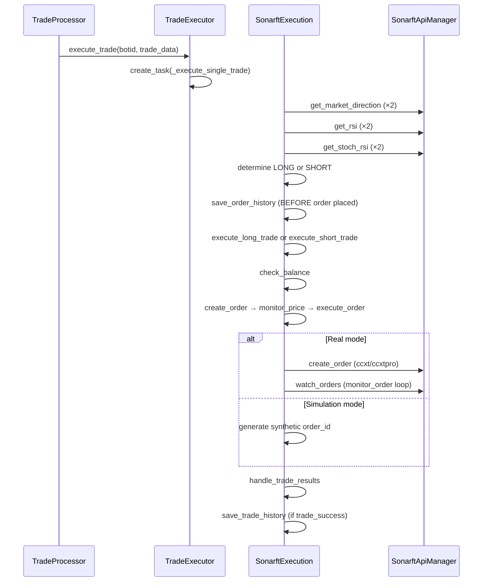

# SonarFT — Execution & Exchange Integration Review

## 1. Execution Flow Summary



---

## 2. API Abstraction Layer

**File:** `sonarft_api_manager.py`, `call_api_method`

```python
method = ccxt_method if self.__ccxt__ else ccxtpro_method
if self.__ccxt__:
    self.sync_wait_for_rate_limit(exchange)
    result = method_call(*args, **kwargs)   # BLOCKING
else:
    await self.wait_for_rate_limit(exchange)
    result = await method_call(*args, **kwargs)
```

The abstraction correctly dispatches to the right library. However:

- The ccxt (REST) branch is **synchronous and blocking** — it blocks the entire asyncio event loop.
- `sync_wait_for_rate_limit` calls `exchange.sleep(rate_limit)` which is also blocking.
- `wait_for_rate_limit` calls `await exchange.sleep(rate_limit)` — this is the ccxtpro async sleep, which is correct.

---

## 3. Exchange Integration Matrix

| Exchange | Supported in EXCHANGE_RULES | Supported in config_exchanges.json | WebSocket (ccxtpro) | REST (ccxt) |
|---|---|---|---|---|
| OKX | Yes | Yes | Yes | Yes |
| Binance | Yes | Yes | Yes | Yes |
| Bitfinex | Yes | Yes | Yes | Yes |
| Any other | **No** — KeyError in calculate_trade | Configurable | Depends on ccxt | Depends on ccxt |

Adding any exchange not in `EXCHANGE_RULES` will crash `calculate_trade` with `KeyError`.

---

## 4. Order Placement Analysis

### `create_order` (`sonarft_execution.py`)

```python
latest_price = await self.monitor_price(exchange_id, base, quote, side, price)
order_placed_id, total_executed_amount, total_remaining_amount = await self.execute_order(
    exchange_id, base, quote, side, trade_amount, latest_price, monitor_order
)
```

`monitor_price` waits until the live price crosses the target price before placing the order. This is a price-chasing mechanism — it ensures the order is placed near the target, but:

1. It has no timeout (infinite loop risk — see async review).
2. If `monitor_price` returns `False` on exception, `execute_order` receives `price=False`, which is passed to `api_manager.create_order` as the price — this will cause an exchange API error.

### `handle_trade_results` (`sonarft_execution.py`)

```python
buy_order_id, buy_executed_amount, buy_remaining_amount = result_buy_order
sell_order_id, sell_executed_amount, sell_remaining_amount = result_sell_order
```

If `result_buy_order` or `result_sell_order` is `None` (order was not placed due to balance failure), this raises `TypeError: cannot unpack non-iterable NoneType`. This is a confirmed crash path.

---

## 5. Simulated Order Execution

**File:** `sonarft_execution.py`, `execute_order`

```python
else:
    executed_amount = trade_amount
    remaining_amount = 0
    order_placed_id = f"{side}_{random.randint(100000, 999999)}"
```

Simulation mode correctly bypasses real order placement. However:

- `monitor_price` is still called in simulation mode — it will loop waiting for a real price condition before placing a simulated order. This means simulation mode still makes live API calls and can block indefinitely.
- Balance checks are correctly bypassed in simulation mode (`check_balance` returns `True` immediately).

**Fix:** Skip `monitor_price` in simulation mode:

```python
if self.is_simulation_mode:
    latest_price = price
else:
    latest_price = await self.monitor_price(...)
```

---

## 6. Partial Fill Handling

`monitor_order` returns `(target_amount, 0)` for filled orders and `(0, target_amount)` for cancelled orders. It does not handle partial fills — if an order is partially filled (status `'open'` with `filled > 0`), the loop continues waiting. There is no logic to detect and handle partial fills.

In `execute_long_trade`:

```python
if buy_executed_amount == buy_trade_amount:
    # proceed to sell
```

If the buy is partially filled, `buy_executed_amount < buy_trade_amount` and the sell leg is never placed — leaving an open buy position with no corresponding sell. This is a **trading safety risk** in live mode.

---

## 7. Failure Mode Table

| Failure | Location | Behaviour | Severity |
|---|---|---|---|
| Exchange API error during order creation | `sonarft_api_manager.py:create_order` | Returns `None`; caller unpacks `None` → crash | **Critical** |
| `result_buy_order` is `None` | `sonarft_execution.py:handle_trade_results` | `TypeError` unpack crash | **Critical** |
| `monitor_price` returns `False` | `sonarft_execution.py:create_order` | `False` passed as price to exchange API | **High** |
| Partial fill on buy leg | `sonarft_execution.py:execute_long_trade` | Sell leg never placed — open position | **High** |
| Exchange not in `EXCHANGE_RULES` | `sonarft_math.py:calculate_trade` | `KeyError` crash | **High** |
| `monitor_price` infinite loop | `sonarft_execution.py:monitor_price` | Trade task hangs forever | **High** |
| `monitor_order` infinite loop | `sonarft_execution.py:monitor_order` | Trade task hangs forever | **High** |
| Simulation mode still calls `monitor_price` | `sonarft_execution.py:create_order` | Simulation blocks on live price | **Medium** |
| Order history saved before order placed | `sonarft_execution.py:_execute_single_trade` | Failed orders appear in history | **Low** |
| Duplicate order IDs in simulation | `sonarft_execution.py:execute_order` | `random.randint(100000,999999)` — 5-digit space, collision possible | **Low** |
