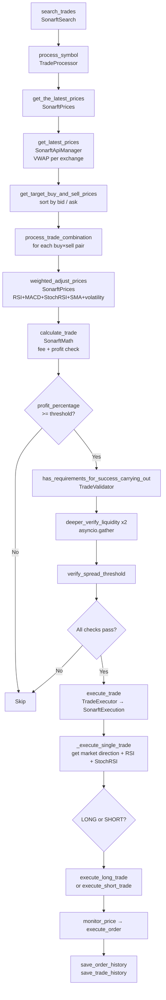

# SonarFT — Trading Engine & Strategy Logic Review

## 1. Trade Pipeline Summary



---

## 2. VWAP Calculation

**File:** `sonarft_api_manager.py`, `get_weighted_prices`

```python
bids = order_book['bids'][:depth]
total_bid_volume = sum(volume for _, volume in bids)
bid_vwap = sum(price * volume for price, volume in bids) / total_bid_volume
```

**Assessment:** Mathematically correct. The formula is standard VWAP.

**Risk:** No guard against `total_bid_volume == 0`. If the order book returns empty bids or asks (e.g. exchange outage, illiquid market), this raises `ZeroDivisionError` which propagates up and causes `get_latest_prices` to return an empty list — silently skipping the symbol. This is fail-safe but the error is swallowed by the outer `except Exception` in `get_latest_prices`.

`SonarftPrices.get_weighted_price` does guard against zero division — but `SonarftApiManager.get_weighted_prices` does not.

---

## 3. Price Adjustment Logic

**File:** `sonarft_prices.py`, `weighted_adjust_prices`

The adjustment formula:

```python
weight = 1 - (volatility * volatility_factor)
adjusted_buy_price = weight * target_buy_price + (1 - weight) * buy_weighted_price
```

**Issues:**

| Issue | Severity | Detail |
|---|---|---|
| `weight` can exceed `[0, 1]` | High | `volatility` is raw std dev of order book prices (unbounded). `volatility_risk_factor=0.001` and `market_strength` (avg RSI, 0–100) can produce `volatility * volatility_factor > 1`, making `weight` negative — inverting the price blend |
| `market_rsi_buy` or `market_rsi_sell` can be `None` | High | If `get_rsi` fails, `market_strength = (None + None) / 2` raises `TypeError`, crashing the entire price adjustment for that symbol |
| `market_stoch_rsi_buy_k/d` can be `None` | High | `get_stoch_rsi` returns `None` on error; comparisons like `market_stoch_rsi_buy_k > market_stoch_rsi_buy_d` raise `TypeError` |
| `support_price` or `resistance_price` can be `None` | Medium | If `get_support_price` returns `None`, `adjusted_buy_price < None` raises `TypeError` |
| Spread factors are hardcoded magic numbers | Low | `spread_increase_factor = 1.00072`, `spread_decrease_factor = 0.99936` — not configurable |
| `bull/bear` mixed conditions not handled | Medium | Only `bull+bull` and `bear+bear` branches apply spread factors; `bull+bear` and `bear+bull` blocks are commented out, leaving neutral behaviour for mixed signals |

---

## 4. Fee Handling

**File:** `sonarft_math.py`, `calculate_trade`

```python
buy_fee_quote = round(buy_price * target_amount_buy * buy_fee_rate, buy_rules['fee_precision'])
value_buying_with_fee = round(value_buying + buy_fee_quote, buy_rules['cost_precision'])
value_selling_with_fee = round(value_selling - sell_fee_quote, sell_rules['cost_precision'])
profit = round(value_selling_with_fee - value_buying_with_fee, sell_rules['fee_precision'])
profit_percentage = round(((value_selling_with_fee - value_buying_with_fee) / value_buying_with_fee), ...)
```

**Assessment:** Fee inclusion is correct — fees are added to buy cost and subtracted from sell proceeds before profit is computed.

**Risk:** `value_buying_with_fee` can be `0` if `buy_price` rounds to `0` (e.g. very small price with `prices_precision=1`). This causes `ZeroDivisionError` in `profit_percentage`. No guard exists.

**Risk:** `calculate_trade` returns `0, 0, 0, None` (4 values) on fee lookup failure, but the caller unpacks only 3 values:

```python
# sonarft_search.py line ~155
profit, profit_percentage, trade_data = self.sonarft_math.calculate_trade(...)
```

This raises `ValueError: too many values to unpack` when fees are not found — crashing `process_trade_combination`.

---

## 5. Execution Gating

**File:** `sonarft_execution.py`, `_execute_single_trade`

The execution path re-fetches market direction, RSI, and StochRSI — all of which were already computed in `weighted_adjust_prices`. This doubles the API call count per trade and introduces a time gap between price adjustment and execution decision, meaning the market state used for execution may differ from the state used for pricing.

**Simulation mode bypass risk:** The `is_simulation_mode` flag is checked in `execute_order` and `check_balance`. Both checks are correct. However, `save_order_history` is called **before** the order is placed (in `_execute_single_trade`), meaning a failed real order still gets recorded as if it were attempted — which is acceptable for audit purposes but could be misleading.

---

## 6. Order Sizing

**File:** `sonarft_math.py`

```python
buy_price = round(buy_price, buy_rules['prices_precision'])
target_amount_buy = round(target_amount, buy_rules['buy_amount_precision'])
```

`EXCHANGE_RULES` only covers `okx`, `bitfinex`, and `binance`. If a different exchange is configured (e.g. `kraken`), `self.EXCHANGE_RULES[buy_exchange]` raises `KeyError`, crashing `calculate_trade`.

---

## 7. Critical Logic Flaws

| # | File | Function | Flaw | Severity |
|---|---|---|---|---|
| 1 | `sonarft_math.py` | `calculate_trade` | Returns 4 values on error, caller unpacks 3 → `ValueError` | **Critical** |
| 2 | `sonarft_prices.py` | `weighted_adjust_prices` | `None` RSI/StochRSI causes `TypeError` crash | **Critical** |
| 3 | `sonarft_math.py` | `calculate_trade` | `KeyError` for exchanges not in `EXCHANGE_RULES` | **High** |
| 4 | `sonarft_prices.py` | `weighted_adjust_prices` | `weight` can go negative with high volatility | **High** |
| 5 | `sonarft_api_manager.py` | `get_weighted_prices` | No zero-division guard on empty order book | **High** |
| 6 | `sonarft_execution.py` | `handle_trade_results` | Unpacks `result_buy_order` / `result_sell_order` without None check — crashes if either order was not placed | **High** |
| 7 | `sonarft_indicators.py` | `market_movement` | `direction = "bear"` branch is missing assignment: `else: "bear"` is a no-op string expression | **Medium** |
| 8 | `sonarft_execution.py` | `execute_trade` | `trade_sucess` (typo) referenced before assignment if `_execute_single_trade` raises | **Medium** |
| 9 | `sonarft_search.py` | `process_symbol` | Returns `None` silently if `buy_prices_list` is empty — no log at warning level | **Low** |
